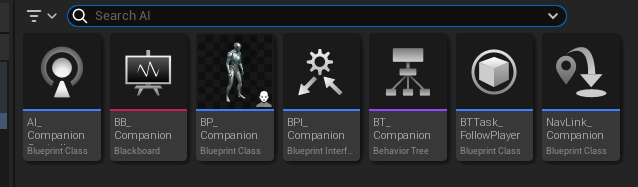
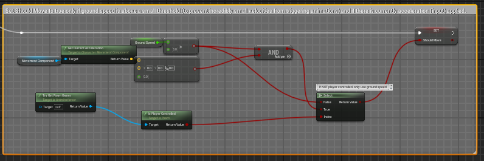
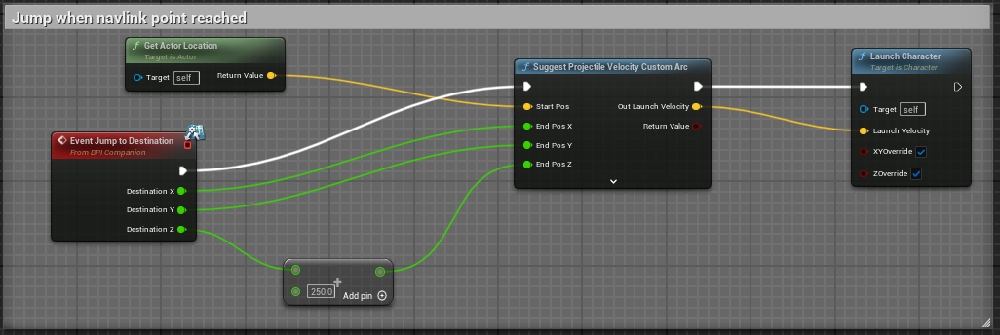

# AI Companion Example
This repo contains a basic example of an Unreal Engine 5 level with a companion AI character that follows the player character.

## Table of Contents
- [Design](#design)
  * [BP_Companion](#bp_companion)
  * [AI_Companion](#ai_companion)
  * [BT_Companion](#bt_companion)
  * [BB_Companion](#bb_companion)
  * [BPTask_FollowPlayer](#bptask_followplayer)
  * [NavLink_Companion](#navlink_companion)
  * [BPI_Companion](#bpi_companion)
 - [Debugging](#debugging)
 - [Additional Features](#additional-features)

## Design

The AI Companion implementation is made up of a several elements which are detailed below:

1. BP_Companion: The blueprint class that assigns companion character properties such as the skeleton mesh and animation.
2. AI_Companion: The custom AI controller class which possesses and connects the behavior tree to the companion character.
3. BT_Companion: The behavior tree that contains all the logic for behavior decision making for the companion character.
4. BB_Companion: The blackboard which contains data for the behavior tree to utilize when making decisions.
5. BTTask_FollowPlayer: The task that implements the behavior to follow the player character and is called in the behavior tree.
6. NavLink_Companion: The custom Nav Link Proxy class that allows the companion character to jump across breaks in the navigation mesh.
7. BPI_Companion: The custom blueprint interface that implements the jump functionality in the blueprint actor and the Nav Link proxy.

### BP_Companion
This class determines the pawn properties for the companion actor in the level. Important properties that were defined are outlined below:
1. Mesh > Skeletal Mesh Asset = SKM_Manny
2. Animation > Anim Class = ABP_Manny
3. Pawn > AI Controller Class = AI_CompanionController
4. Character Movement Walking > Max Walk Speed = 400 cm/s
5. Character Movement Rotation > Use Controller Desired Rotation = True

For the animation class, I had to make a small adjustment in order to handle an AI character that had no input. This can be achieved by checking if the pawn owner is player controlled. If true, set the return value equal to the original branch return (ground speed + current accleration). If false, set the return value equal to only the ground speed. This will ensure the animation works correctly for the AI character.

### AI_Companion
This class contains the logic to connect the behavior tree to the companion character. It consists of a single node: Run Behavior Tree which is called on Event BeginPlay (when level is started). The Run Behavior Tree node has an input BTAsset which is set to BT_Companion.

### BT_Companion
The behavior tree is quite simple for this basic example. The root node is connected to a Selector node which is then connected to a BTTask_FollowPlayer node. 

Because there is no real decision making in this example, a simpler design might be to hold the AI MoveTo logic in the BP_Companion class instead. However, I made the decision to include the behavior tree to that I could gain a better understanding of the AI features in Unreal and to ensure minimal refactoring if a more complex behavior system was required later in the process. 

### BB_Companion
The blackboard contains keys that are utilized by the behavior tree to make decisions such as within conditional decorators. The current implementation does not use any of these keys the behavior tree. An additional feature that could make use of these keys is implementing a perception system that determines if the player character is in line of sight of the companion character. It could also be used to set a last known location vector when the companion character loses sight of the player character. These features are particularly useful for enemy AI.

However, for the purposes of companion AI, I wanted the companion character to always follow the player character, regardless of perception, since it could be annoying to the player to have to backtrack and find the companion AI if it stopped following because of sightlines.

### BPTask_FollowPlayer
This class contains logic for behavior to follow the player character. It utilizes an AI Move To node that triggers on a Receive Execute AI event. The inputs are as follows:
1. Pawn = Controlled Pawn (from AI node)
2. Target Actor = Get Player Character node (we want the AI to target the player character)

An important aspect to note here is that a Finish Execute node is **required** for the task to execute. This is needed on both the "On Success" and "On Fail" conditions and the Success checkbox should be marked appropriately for each condition.

### NavLink_Companion
This class allows for the AI character to navigate across the boundaries of the navigation mesh. I wanted the companion AI to be able to follow the player character, even if it jumped across platforms. It is subclassed from the Nav Link Proxy class and uses smart links to trigger jump behavior when the smart link location is reached by the companion character. It implements the interface function "Jump to Destination" to pass a destination vector to the jump behavior nodes in the BP_Companion class.

### BPI_Companion
This interface contains a "Jump to Destination" function that allows for the destination vector in the smart nav link to be utilized in the BP_Companion event graph. In the jump logic, the Launch Character node is triggered when the "Jump to Destination" function is called. It takes in a Suggested Project Velocity with end positions outputted by the "Jump to Destination" function. This is not the most precise method of calculating jump velocity but is adequate for this basic example. 

## Debugging
Unreal has built in debugging tools for AI. To display debugging information, press the ' key while playing the game. The different debugging modes can be navigated with the number keys. See here for more detailed information: 

To visualize the NavMesh, press the p key while in the editor. This will highlight the level in green where the navmesh is active.

## Additional Features
This basic example does not implement features such as the perception system and the EQS system which could be used to create more complex AI behaviors. The perception system uses senses such as sight, sound, damage, etc. to determine behavior. The EQS system provides functionality for character awareness of the level environment such as obstacles or items. This could be used in tandem with smart objects to implement behavior useful for a companion AI such as hiding in cover when hearing gunfire.

## Learning Resources
* Unreal Engine AI Docs - https://dev.epicgames.com/documentation/en-us/unreal-engine/artificial-intelligence-in-unreal-engine 
* Unreal Engine AI Presentation – https://www.youtube.com/watch?v=iY1jnFvHgbE 
* AI Unreal Engine 5 Tutorial (first 4 videos) - https://www.youtube.com/watch?v=bx7taRBjJgM&list=PL4G2bSPE_8uklDwraUCMKHRk2ZiW29R6e&index=3
* Smart Enemy AI Tutorial - https://www.youtube.com/watch?v=G4GHa-zmQR8 

